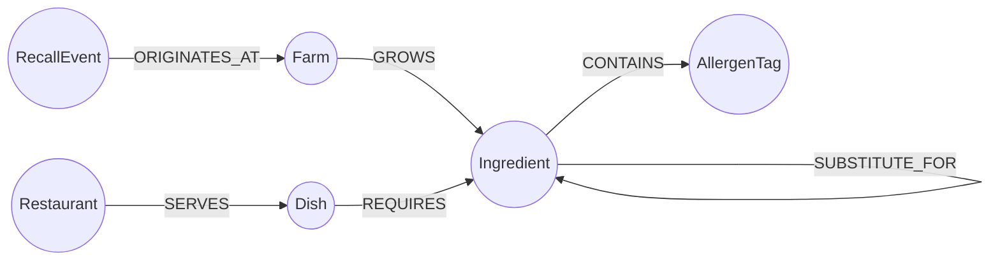

# FarmTrace


**Trace every dish back to the farm it grew in — and instantly see what a recall touches.**

FarmTrace is a farm-to-table traceability app for restaurant groups and food-safety teams. It models the full chain from **Farm → Ingredient → Dish → Restaurant**, so you can:

- Trace any menu item back to its source farms and flag allergens, in one click.
- Simulate a **recall** at a farm and see every dish and restaurant it touches, computed with a single 4-hop graph traversal.
- Find **allergen-safe substitute ingredients** by walking a chain of "can stand in for" relationships.
- Spot **shared supply-chain risk** between restaurants that unknowingly source from the same farm.

Built for the Wexa AI take-home assignment, backed by **CognoDB** (a managed graph database speaking openCypher over Bolt) via the official Neo4j driver.

---

## Why a graph database?

Food provenance is a network problem, not a table problem. The questions that actually matter — *"if this farm gets recalled, which dishes at which restaurants are affected, and how many hops away is the exposure?"* — are traversal questions, not join questions.

In a relational schema, `Farm → Ingredient → Dish → Restaurant` is four tables and three join tables (many-to-many at every step: one ingredient comes from multiple farms, one dish uses many ingredients, one restaurant serves many dishes, one dish can be served at several restaurants). Answering "what does a recall at Farm X affect?" means a four-way join across all of them, and the join fan-out grows differently depending on how many ingredients a dish needs — the SQL gets uglier as the model gets more realistic.

Two queries make the case concretely:

1. **Recall blast-radius** (`recallImpact` in `backend/queries.js`) is a single Cypher pattern: `(RecallEvent)-[:ORIGINATES_AT]->(Farm)-[:GROWS]->(Ingredient)<-[:REQUIRES]-(Dish)<-[:SERVES]-(Restaurant)`. It reads as the actual shape of the domain. The equivalent SQL is a 4-table join with two junction tables, and it only gets worse if the recall needs to also account for `SUBSTITUTE_FOR`-linked ingredients.
2. **Allergen-safe substitutes** (`allergenSafeSubstitutes`) needs a *variable-length* walk across `SUBSTITUTE_FOR` edges (1 to 3 hops) to find the nearest ingredient that doesn't carry a given allergen. This is exactly the case relational databases are weakest at — it requires a recursive CTE in SQL, re-written per allergen, versus one bounded-length pattern (`*1..3`) in Cypher.

A graph database also makes the schema resilient to the question changing. Asking "which restaurants share supply risk with restaurant X" or "how many hops separate this dish from any tree-nut ingredient" doesn't require new junction tables or new joins — it's a new pattern over the same graph.

---

## Data model



**Nodes**

| Label | Key properties |
|---|---|
| `Farm` | `id`, `name`, `region`, `certification` |
| `Ingredient` | `id`, `name`, `category` |
| `AllergenTag` | `id`, `name` |
| `Dish` | `id`, `name`, `description`, `price` |
| `Restaurant` | `id`, `name`, `city`, `cuisine` |
| `RecallEvent` | `id`, `reason`, `date`, `severity` |

**Relationships**

| Relationship | Direction | Properties |
|---|---|---|
| `(Farm)-[:GROWS]->(Ingredient)` | Farm supplies an ingredient | — |
| `(Ingredient)-[:CONTAINS]->(AllergenTag)` | Ingredient carries an allergen | — |
| `(Ingredient)-[:SUBSTITUTE_FOR]->(Ingredient)` | Culinary substitute | `similarity` (0–1) |
| `(Dish)-[:REQUIRES]->(Ingredient)` | Dish uses an ingredient | `quantity`, `unit` |
| `(Restaurant)-[:SERVES]->(Dish)` | Restaurant has it on the menu | — |
| `(RecallEvent)-[:ORIGINATES_AT]->(Farm)` | Recall traces to a farm | — |

Seed dataset: 8 farms, 20 ingredients, 6 allergen tags, 10 dishes, 5 restaurants, 2 recall events, 8 substitute relationships (~65 nodes, ~120 relationships total) — well inside CognoDB's free-tier limits.

---

## Project structure

```
farmtrace/
├── backend/
│   ├── server.js          # Express app, static file serving, health gate, error handling
│   ├── db.js               # Neo4j driver singleton + query/write helpers
│   ├── queries.js          # Every Cypher statement, documented, parameterised
│   └── routes/
│       ├── dishes.js        # /api/dishes, /:id/trace, /:id/allergen-substitutes
│       ├── farms.js         # /api/farms
│       ├── restaurants.js   # /api/restaurants, /:id/shared-risk
│       ├── recalls.js       # /api/recalls, /:id/impact  (the 4-hop traversal)
│       └── ingredients.js   # /api/ingredients/search, /:id/exposure
├── seed/
│   ├── data.js              # Seed dataset (farms, ingredients, dishes, ...)
│   └── seed.js              # Idempotent loader — creates constraints, MERGEs everything
├── frontend/
│   ├── index.html
│   ├── style.css            # Token-driven design system (see below)
│   └── app.js                # Vanilla JS — fetches the API, renders the trace SVG
├── .env.example
└── README.md
```

No frontend build step: `frontend/` is plain HTML/CSS/JS served statically by Express, so `npm start` is the whole setup.

---

## Setup

### 1. Create your CognoDB Cloud instance

1. Go to [console.cognodb.com/signup](https://console.cognodb.com/signup) and create a free account (no credit card required).
2. From the console, create a **free (c0) instance** and pick a region. It provisions in under a minute.
3. Copy the connection URI (`bolt+s://<instance-id>.databases.cognodb.cloud`) and the generated password for user `cognodb` — **the password is shown only once**, so save it immediately.

### 2. Configure environment variables

```bash
cp .env.example .env
```

Edit `.env`:

```
COGNODB_URI=bolt+s://<your-instance-id>.databases.cognodb.cloud
COGNODB_USER=cognodb
COGNODB_PASSWORD=<your generated password>
PORT=4000
```

`.env` is git-ignored — connection details are never committed.

### 3. Install dependencies

```bash
cd backend
npm install
```

### 4. Seed the database

```bash
npm run seed
```

This applies uniqueness constraints and loads the dataset in `seed/data.js` using `MERGE`, so it's safe to re-run.

### 5. Run the app

```bash
npm start
```

Open **http://localhost:4000**.

If CognoDB is unreachable (instance paused, wrong password, network issue), the server still starts and serves the UI, but API calls return a clean `503` with an explanation instead of hanging — the frontend surfaces this as a status badge and inline error states rather than a blank screen. It retries the connection in the background every 15 seconds and recovers automatically.

---

## The main queries, explained

All queries live in `backend/queries.js`, parameterised, and are run through the official Neo4j driver (`backend/db.js`) — no string-concatenated Cypher anywhere in the codebase.

- **`recallImpact`** — the flagship multi-hop traversal (4 hops): `RecallEvent → Farm → Ingredient → Dish → Restaurant`. Powers the "Recall impact" tab: pick a recall, see every affected dish and restaurant.
- **`allergenSafeSubstitutes`** — variable-length path (`*1..3`) across `SUBSTITUTE_FOR` to find the nearest ingredient that doesn't carry a given allergen. Powers the substitute finder on each dish page.
- **`dishTrace`** — pulls a dish's full ingredient list plus each ingredient's source farm(s) and allergen tags in one query; powers the animated farm-to-plate diagram.
- **`sharedSupplyRisk`** — a symmetric 6-hop pattern finding other restaurants that source from the same farms as a given restaurant. Awkward in SQL (a self-join across the same many-to-many chain twice); natural as one Cypher pattern.
- **`ingredientExposure`** — fan-out from a single ingredient to every dish/restaurant that uses it, plus its source farms.

---

## UI

- **Dishes & sourcing** — browse and search dishes; select one to see an animated farm→ingredient→dish→restaurant trace diagram, a full ingredient table with allergen flags, and an allergen-safe substitute finder.
- **Recall impact** — pick a recall event; see summary stats (dishes/restaurants affected) and the full impact table from the 4-hop query.
- **Restaurants** — browse restaurants; select one to see which others share supply-chain risk through common farms.

Design system: dark "field ledger" palette (moss green / soil brown / parchment / alert red), `Fraunces` for display type, `Inter` for UI text, `IBM Plex Mono` for data and IDs. Loading states use skeleton rows, empty states use explanatory copy, and network/database errors render inline rather than failing silently.

*(Add screenshots here before submitting — e.g. `docs/screenshot-dishes.png`, `docs/screenshot-recall.png`.)*

---

## Deploying the demo

The app is a single Express server serving both the API and the static frontend, so it deploys as one service on any Node host (Render, Railway, Fly.io, a small VPS, etc.):

1. Push this repo to GitHub.
2. Create a new web service pointing at the repo, root directory `backend/`, build command `npm install`, start command `npm start`.
3. Set the `COGNODB_URI`, `COGNODB_USER`, `COGNODB_PASSWORD` environment variables in the host's dashboard (not in the repo).
4. Run `npm run seed` once (locally, pointed at the same CognoDB instance, or as a one-off deploy job) to load data.

---

## Notes

- Keep the CognoDB instance running after submission in case it needs to be tested against live data.
- All Cypher is parameterised via the driver (`$param` placeholders) — never string-concatenated.
