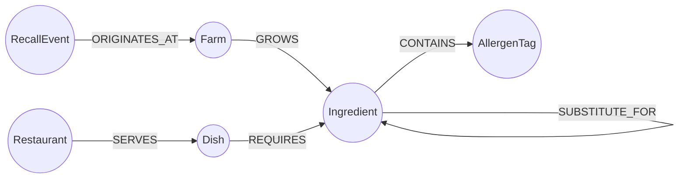

# FarmTrace


**Trace every dish back to the farm it grew in — and instantly see what a recall touches.**

# FarmTrace

Trace any dish back to the farm it came from — and see instantly what a food recall actually touches.

I built this for the Wexa AI take-home assignment. It's a small app for restaurant groups that answers three questions a food-safety manager actually cares about:

- If a farm gets recalled, which dishes and which restaurants does that affect?
- If a customer has an allergy, is there a safe substitute for the ingredient causing the problem?
- Do two restaurants share risk because they're quietly buying from the same farm?

It's backed by **CognoDB** (a managed graph database that speaks Cypher over Bolt), using the standard Neo4j JS driver.

---

## Why I picked a graph database for this

Food sourcing is basically a network — farm feeds ingredient, ingredient feeds dish, dish gets served at a restaurant. The question I actually care about ("what does this recall touch?") isn't "give me rows from a table," it's "walk this chain and tell me everything downstream." That's a graph traversal, not a join.

If I'd built this in a relational database, I'd need a `Farm` table, an `Ingredient` table, a `Dish` table, a `Restaurant` table, plus junction tables for every many-to-many relationship between them (one ingredient can come from several farms, one dish uses many ingredients, one dish can be on multiple restaurants' menus, etc). Answering "what does a recall at Farm X affect" means joining across all of that, and it gets messier the more realistic the data gets.

Two queries show this pretty clearly:

- **`recallImpact`** is one Cypher pattern: `(RecallEvent)-[:ORIGINATES_AT]->(Farm)-[:GROWS]->(Ingredient)<-[:REQUIRES]-(Dish)<-[:SERVES]-(Restaurant)`. That line basically *is* the question I'm asking — no joins to reason about.
- **`allergenSafeSubstitutes`** needs to hop across "can substitute for" relationships up to 3 times to find something allergen-free. In SQL that's a recursive CTE, and you'd need to rewrite it for every allergen. In Cypher it's just `*1..3` on the relationship.

The other nice thing: if the question changes later (e.g. "how many hops is this dish from any tree-nut ingredient?"), I don't need new tables — it's just a new pattern over the same graph.

---

## The data model



**Nodes:**

| Label | What it stores |
|---|---|
| `Farm` | id, name, region, certification |
| `Ingredient` | id, name, category |
| `AllergenTag` | id, name |
| `Dish` | id, name, description, price |
| `Restaurant` | id, name, city, cuisine |
| `RecallEvent` | id, reason, date, severity |

**Relationships:**

| Relationship | Meaning | Properties |
|---|---|---|
| `(Farm)-[:GROWS]->(Ingredient)` | this farm supplies this ingredient | — |
| `(Ingredient)-[:CONTAINS]->(AllergenTag)` | this ingredient carries this allergen | — |
| `(Ingredient)-[:SUBSTITUTE_FOR]->(Ingredient)` | can stand in for | `similarity` |
| `(Dish)-[:REQUIRES]->(Ingredient)` | dish needs this ingredient | `quantity`, `unit` |
| `(Restaurant)-[:SERVES]->(Dish)` | it's on the menu | — |
| `(RecallEvent)-[:ORIGINATES_AT]->(Farm)` | recall traces back to this farm | — |

Seed data: 8 farms, 20 ingredients, 6 allergens, 10 dishes, 5 restaurants, 2 recalls, 8 substitute links — small on purpose, since CognoDB's free tier only gives you 256MB of RAM.

---

## How the project is laid out

```
farmtrace/
├── backend/
│   ├── server.js          # Express app — serves the frontend + API, handles DB downtime gracefully
│   ├── db.js               # sets up the Neo4j driver, runs queries
│   ├── queries.js          # every Cypher query lives here, parameterised
│   └── routes/
│       ├── dishes.js
│       ├── farms.js
│       ├── restaurants.js
│       ├── recalls.js       # this is where the 4-hop recall query lives
│       └── ingredients.js
├── seed/
│   ├── data.js              # the actual sample data
│   └── seed.js              # loads it into CognoDB, safe to re-run
├── frontend/
│   ├── index.html
│   ├── style.css
│   └── app.js                # plain JS, no framework, no build step
├── .env.example
└── README.md
```

No build tools on the frontend — it's just HTML/CSS/JS served by Express, so running the app really is just `npm start`.

---

## Getting it running

### 1. Spin up a CognoDB instance

Go to [console.cognodb.com/signup](https://console.cognodb.com/signup), sign up (no card needed), and create a free `c0` instance. Takes under a minute. You'll get a URI like `bolt+s://<id>.databases.cognodb.cloud` and a password — **copy the password immediately, it's only shown once.**

### 2. Set up your `.env`

```bash
cp .env.example .env
```

Then fill in:

```
COGNODB_URI=bolt+s://<your-instance-id>.databases.cognodb.cloud
COGNODB_USER=cognodb
COGNODB_PASSWORD=<your password>
PORT=4000
```

(`.env` is already git-ignored, so this never gets committed.)

### 3. Install and seed

```bash
cd backend
npm install
npm run seed
```

### 4. Run it

```bash
npm start
```

Then open `http://localhost:4000`.

If CognoDB happens to be down or unreachable when the server starts, the app doesn't crash — it still serves the page, just returns a clean error instead of hanging, and quietly retries the connection every 15 seconds in the background.

---

## The main queries, in plain terms

Everything lives in `backend/queries.js`, and every single query uses `$parameters` — nothing is ever built by gluing strings together.

- **`recallImpact`** — the core traversal: walks Farm → Ingredient → Dish → Restaurant in one go, 4 hops. This is what powers the recall page.
- **`allergenSafeSubstitutes`** — a variable-length walk (1 to 3 hops) across substitute relationships to find something allergen-free.
- **`dishTrace`** — pulls a dish's ingredients, their source farms, and their allergens all in one query, for the trace diagram.
- **`sharedSupplyRisk`** — finds other restaurants that pull from the same farms as the one you picked. This one's a 6-hop pattern that would be a nasty self-join in SQL.
- **`ingredientExposure`** — given one ingredient, shows everywhere it's used.

---

## What the app actually looks like

- **Dishes & sourcing** — pick a dish, see an animated diagram of where every ingredient came from, plus an allergen substitute finder.
- **Recall impact** — pick a recall, see exactly which dishes and restaurants it reaches.
- **Restaurants** — pick a restaurant, see which others share supply risk with it.

Visually I went with a dark, earthy "field ledger" look — moss green, soil brown, parchment, a red for alerts — using Fraunces for headings and Inter for body text. Loading states use skeleton placeholders, empty states explain what to do next, and if something breaks (like the database being unreachable) it shows an actual message instead of just failing silently.

---

## Deploying

It's a single Express server doing both API and frontend, so it deploys anywhere that runs Node — I used Render:

1. Push to GitHub.
2. New Web Service on Render, root directory `backend`, build command `npm install`, start command `npm start`.
3. Add `COGNODB_URI`, `COGNODB_USER`, `COGNODB_PASSWORD` as environment variables in Render's dashboard (not in the code).
4. Run `npm run seed` once, pointed at the same database.

---

## A couple of notes

- I'm keeping the CognoDB instance running after submitting, in case it needs to be tested live.
- Every query goes through the driver's parameter binding — no string-concatenated Cypher anywhere in the code.
